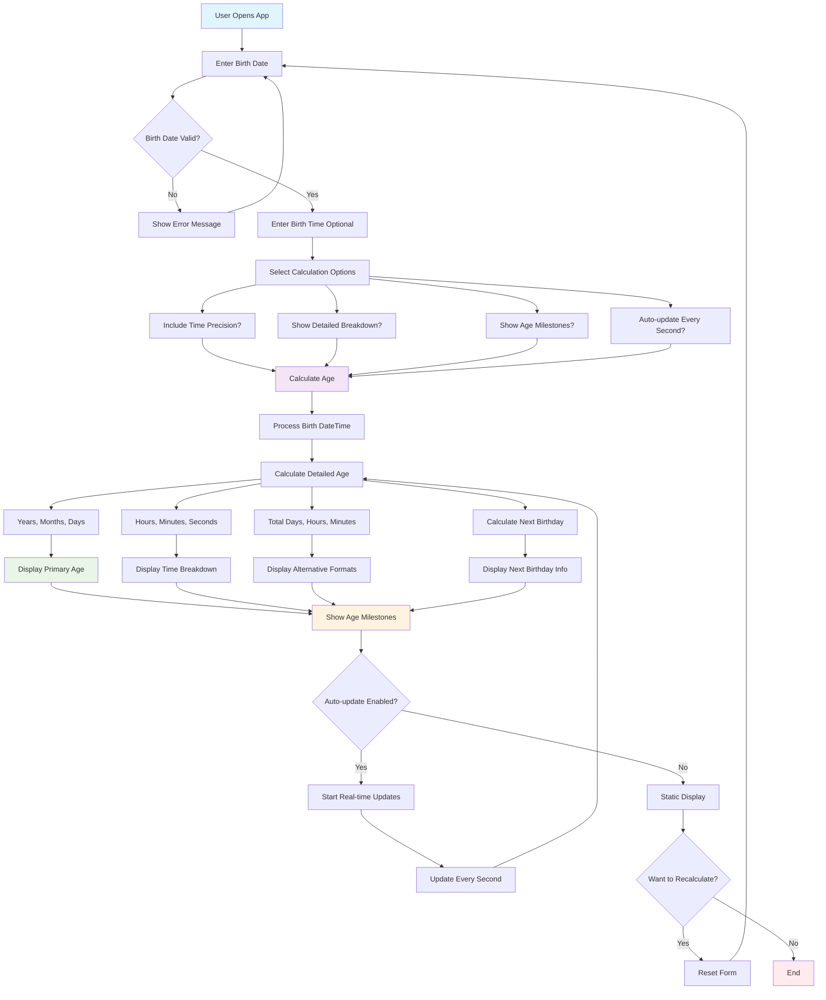

# Advanced Age Calculator


## 🎯 Overview

**Advanced Age Calculator** is a robust, interactive web app built using only HTML, CSS, and JavaScript. It provides detailed and accurate age calculations, from years down to seconds, offers multiple output formats, real-time updating, milestone tracking, and a modern user experience. It's ideal for both personal use and as a feature module in broader web applications.

---

## ✨ Features

### Core
- **Precise Age Calculation:** Down to years, months, days, hours, minutes, seconds
- **Date & Time Support:** Optional time-of-birth for sub-day precision
- **Instant & Real-time Calculations:** Toggle live updating age counters
- **Comprehensive Validation:** Prevents future dates, invalid input, etc.

### Advanced
- **Detailed Breakdown:** Human-readable and numeric breakdowns
- **Alternative Representations:** Total days, hours, minutes, seconds, weeks, and months
- **Milestone Tracking:** Highlights significant birthdays (18, 25, 50, etc.)
- **Next Birthday Countdown:** Shows days (and time) until your next birthday
- **Custom Options:** Enable/disable features as desired

### User Experience
- **Responsive Design:** Looks great on desktop and mobile
- **Modern, Accessible UI:** Keyboard navigation, screen reader-friendly markup, and attractive gradients/animations
- **Performance-Optimized:** Minimal resource usage, fast updates

---

## 🚀 Demo


> _Replace with your actual screenshots in `/assets/screenshots/`_

---

## 🛠️ Installation

### Prerequisites
- Any modern browser (Chrome, Edge, Safari, Firefox, Opera)

### Quick Start
1. **Clone the repo:**
   ```bash
   git clone https://github.com/sinha-19/Advanced-Age-Calculator.git
   cd Advanced-Age-Calculator
   ```
2. **Open `index.html` in your browser:**
   - Double-click the file, or
   - Run a static server (`npx live-server`, `python -m http.server`, etc.)

_No dependencies, no build step required!_

---

## 📖 Usage

1. Enter your date of birth (and optionally, time).
2. Select any advanced calculation/display options.
3. Click "Calculate Age".
4. Browse your results: age in years/months/days, time breakdown, next birthday, milestones, etc.
5. Enable real-time updates for a live ticking age!
6. To recalculate, reset the form and repeat.

---

## 🧮 Age Calculation Methods

- **Handles leap years, varying month lengths, and precise time math.**
- **Displays both human-friendly ("25 years, 8 months, 3 days") and numeric ("9,287 days") outputs.**
- **All calculations are performed in-browser using modern JavaScript Date APIs.**

---

## 🔢 Age Milestones

- Childhood (1, 5, 10, 13)
- Young Adult (16, 18, 21, 25)
- Adult (30, 40, 50, 60)
- Senior (65, 70, 80, 90, 100)
- Each milestone is highlighted when reached, with upcoming milestones shown for reference.

---

## 🔧 Technologies Used

- **HTML5:** Semantic markup
- **CSS3:** Responsive design, custom properties, gradients, animations
- **JavaScript (ES6+):** Date manipulation, UI logic, real-time updates
- **No frameworks/dependencies**

---

## 📁 Project Structure

```
Advanced-Age-Calculator/
├── index.html
├── style.css
├── script.js
├── README.md
└── assets/
    ├── favicon.ico
    └── screenshots/
        ├── desktop.png
        └── mobile.png
```

---

## 🎨 Customization

- **Color scheme/theme:** Edit CSS custom properties in `style.css`
- **Animations:** Adjust animation classes and durations in CSS
- **Milestones:** Edit/extend milestone list in JS
- **Add new formats:** Expand result section in JS/HTML

---

## 🤝 Contributing

1. Fork the repo
2. Create a new branch (`git checkout -b feature/feature-name`)
3. Commit, push, and open a pull request
4. Include screenshots for UI changes and update the README where appropriate

**Contribution ideas:** Bugfixes, new features, performance, accessibility, i18n.

---

## 📝 License

MIT License - see [LICENSE](LICENSE) for details.

---

## 👨‍💻 Developer

**Developed by Saket Kumar Sinha**

- [GitHub](https://github.com/sinha-19)
- [LinkedIn](https://linkedin.com/in/saketkumarsinha19)  
- [Email](mailto:imsaket123@gmail.com)

---

## 🙏 Acknowledgments

- Emoji icons for universal compatibility
- [MDN Web Docs](https://developer.mozilla.org/) for JavaScript Date methods
- Inspiration from modern web calculators

---

## 🔮 Future Enhancements

- Age statistics vs. global averages
- Calendar and reminder integrations
- PWA/mobile app support
- Dark mode and theming
- Internationalization (multi-language support)
- Visual age graphs

---

## 💡 Tips & Tricks

- Enter your exact birth time for highest accuracy
- Enable auto-update to see your age tick in real-time
- Works offline once loaded!

---

## 🏷️ Version History

- **v1.0.0:** Core functionality and UI
- **v1.1.0:** Real-time updates, milestones
- **v1.2.0:** Responsive design, accessibility

---

## 🌐 Browser Compatibility

| Browser | Supported  |
|---------|------------|
| Chrome  | ✅         |
| Firefox | ✅         |
| Safari  | ✅         |
| Edge    | ✅         |
| Opera   | ✅         |
| IE11    | ⚠️ Partial |

---

_Made with ❤️ by Saket Kumar Sinha_

**If you found this project helpful, please ⭐ the repo!**
